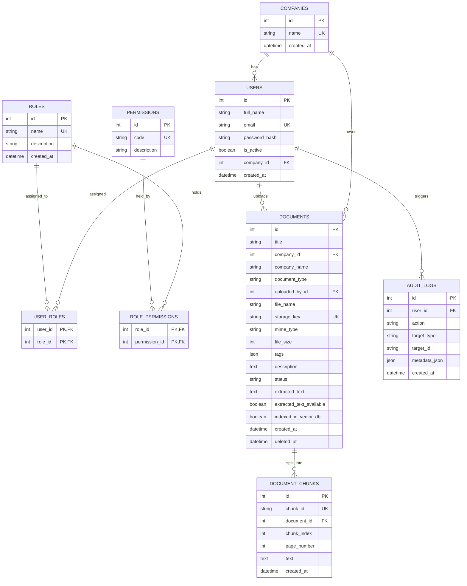

# Financial Document Management API

## Project Overview

FastAPI backend for financial document management with metadata search, semantic search, Qdrant indexing, and RAG-ready context retrieval. The system helps teams upload financial documents, protect access with JWT and RBAC, extract document text, generate embeddings, and retrieve relevant financial context using semantic search.

Supported document workflows include reports, invoices, contracts, and agreements.

## Tech Stack

- **Backend:** FastAPI
- **ORM:** SQLAlchemy
- **Database:** SQLite for local development, PostgreSQL supported through `DATABASE_URL`
- **Validation:** Pydantic
- **Authentication:** JWT bearer tokens
- **Password hashing:** Passlib bcrypt
- **Document extraction:** `pypdf`, `python-docx`, native TXT reader
- **RAG orchestration:** LangChain text splitters
- **Embeddings:** Sentence Transformers
- **Vector database:** Qdrant
- **Testing:** Pytest and FastAPI TestClient

## Architecture

The service uses a layered backend architecture:

- **API layer:** FastAPI routers under `/api/v1`.
- **Auth/RBAC:** JWT access tokens, bcrypt password hashing, reusable permission dependencies.
- **Persistence:** PostgreSQL, SQLAlchemy ORM, Alembic migrations.
- **Document pipeline:** Upload validation, local storage abstraction, PDF/DOCX/TXT extraction, metadata persistence.
- **RAG pipeline:** extracted text -> cleaning/splitting -> embeddings -> Qdrant payload-indexed chunks -> reranking.
- **Auditability:** business and security actions are recorded in `audit_logs`.

Local file storage is intentionally wrapped by `StorageService` so object storage can replace it later without changing routers.

## Assumptions

- Each user belongs to one primary company.
- Admin users can access all companies.
- Non-admin users are tenant-scoped to their `company_id`.
- Client users can view only documents in their own company and cannot search all metadata or delete.
- Indexing is synchronous for the first implementation; the service boundary supports future background jobs.
- Refresh tokens are a future extension. Current implementation uses short-lived JWT access tokens.
- Default reranking is a lightweight financial lexical + semantic weighted reranker. A cross-encoder can be added behind the same abstraction.

## Folder Structure

Below is the complete project directory structure detailing all major source files, services, and modules:

```text
finance-rag-pipeline/
├── alembic/                      # Database migration configurations
│   ├── env.py                    # Alembic environment setup
│   └── versions/                 # Migration script version history
│       ├── 0001_initial.py
│       └── 0002_add_agreement_document_type.py
├── app/                          # Core application logic
│   ├── api/                      # Routing and endpoint definitions
│   │   ├── deps.py               # Reusable dependencies (Auth, DB, RBAC)
│   │   └── v1/
│   │       ├── router.py         # Main API router gathering sub-routers
│   │       └── endpoints/        # Sub-routers for different services
│   │           ├── auth.py       # Registration, Login, Token generation
│   │           ├── documents.py  # File upload, retrieval, and listing
│   │           ├── rag.py        # Indexing, searching, and context extraction
│   │           └── rbac.py       # Role assignment and permissions verification
│   ├── core/                     # Application configurations & global modules
│   │   ├── config.py             # Pydantic base settings and env parsing
│   │   ├── exceptions.py         # Custom HTTP and application exceptions
│   │   ├── logging.py            # Loggers and standard output formatters
│   │   └── security.py           # JWT creation, decoding, and password hashing
│   ├── db/                       # Database engine setup and seed script
│   │   ├── init_db.py            # DB engine and session factory creation
│   │   ├── session.py            # Session getters and Declarative Base class
│   │   └── seed.py               # Initial seed script for companies, users, roles
│   ├── models/                   # SQLAlchemy database models
│   │   ├── audit.py              # Audit log schemas
│   │   ├── company.py            # Multi-tenant Company schema
│   │   ├── document.py           # Document and DocumentChunk schemas
│   │   ├── enums.py              # Status and Type Enums (StrEnum)
│   │   ├── rbac.py               # Role, Permission, and Association tables
│   │   └── user.py               # User authentication schema
│   ├── rag/                      # RAG logic (Embeddings, Vector Store, Reranker)
│   │   ├── embeddings.py         # Local / Hugging Face embedding generation
│   │   ├── rerankers.py          # Fallback Lexical & Semantic reranking logic
│   │   └── vector_store.py       # Qdrant client connection and payload indexing
│   ├── rbac/                     # Permission sets and access control helpers
│   │   ├── access.py             # User access and role matching logic
│   │   └── permissions.py        # System-wide Permission code strings
│   ├── repositories/             # Database queries and CRUD abstraction layers
│   │   ├── documents.py          # Document querying logic
│   │   ├── rbac.py               # Role & permission mapping queries
│   │   └── users.py              # User retrieval and registration queries
│   ├── schemas/                  # Pydantic validation and serialization models
│   │   ├── auth.py               # Login, registration, token response models
│   │   ├── common.py             # Reusable API response schemas
│   │   ├── document.py           # Metadata, upload, listing schemas
│   │   ├── rag.py                # Search query and context generation schemas
│   │   └── rbac.py               # Role and permission response models
│   ├── services/                 # Complex business logic orchestrators
│   │   ├── audit.py              # Action recording services
│   │   ├── auth.py               # JWT logic wrapper
│   │   ├── documents.py          # Upload processing & storage operations
│   │   ├── extraction.py         # File text extractors (PDF, DOCX, TXT)
│   │   ├── rag.py                # Text splitting, vector indexing & search pipelines
│   │   ├── rbac.py               # DB-level role/permission update operations
│   │   └── storage.py            # Storage driver abstraction (Local/Cloud placeholder)
│   ├── utils/                    # Shared helper utilities
│   │   └── responses.py          # Unified response builder helpers
│   └── main.py                   # FastAPI main entrypoint configuration
├── tests/                        # Integration and unit tests
│   ├── conftest.py               # Pytest configurations, DB session mocks, test clients
│   ├── test_auth_rbac.py         # Authentication and authorization tests
│   ├── test_documents.py         # Document lifecycle and metadata tests
│   └── test_rag.py               # Chunking, indexing, and search tests
├── .gitignore                    # Local files ignored by git
├── alembic.ini                   # Alembic database migration CLI settings
├── pyproject.toml                # Project metadata and tooling preferences
├── requirements.txt              # Production and development pip dependencies
└── README.md                     # Project documentation (this file)
```


## Database Schema

Core tables:

- `companies`
- `users`
- `roles`
- `permissions`
- `user_roles`
- `role_permissions`
- `documents`
- `document_chunks`
- `audit_logs`

### Entity Relationship Diagram (ERD)

Below is the Entity Relationship Diagram representing the database models, their attributes, and relationships. It is rendered using Mermaid:



Important constraints and indexes:

- Unique user emails.
- Unique role names and permission codes.
- Unique document storage keys.
- Indexed document fields for tenant and metadata filtering: company, type, uploader, status, created date, title.
- Foreign keys across user/company/document/chunk/audit relationships.

## RBAC

Seeded roles:

| Role | Access |
| --- | --- |
| Admin | Full access |
| Financial Analyst | Upload, edit-ready permission, view, metadata search, RAG index/search/context |
| Auditor | View, metadata search, RAG search/context |
| Client | View and context only for own company |

Endpoints use reusable permission dependencies such as `require_permission("documents:upload")`.

## APIs

The API is available both without a prefix and under `/api/v1`. For example, both `/auth/login` and `/api/v1/auth/login` work.

Health:

- `GET /health`

Auth:

- `POST /api/v1/auth/register`
- `POST /api/v1/auth/login`

RBAC:

- `POST /api/v1/roles/create`
- `POST /api/v1/users/assign-role`
- `GET /api/v1/users/{id}/roles`
- `GET /api/v1/users/{id}/permissions`

Documents:

- `POST /api/v1/documents/upload`
- `GET /api/v1/documents`
- `GET /api/v1/documents/{document_id}`
- `DELETE /api/v1/documents/{document_id}`
- `GET /api/v1/documents/search`

RAG:

- `POST /api/v1/rag/index-document`
- `DELETE /api/v1/rag/remove-document/{document_id}`
- `POST /api/v1/rag/search`
- `GET /api/v1/rag/context/{document_id}`

## Authentication Flow

1. A user registers through `POST /auth/register`.
2. The password is hashed before being stored.
3. The user logs in through `POST /auth/login`.
4. The API returns a JWT access token.
5. Protected endpoints require:

```text
Authorization: Bearer <access-token>
```

6. The current-user dependency validates the JWT, loads the user, and checks whether the user is active.
7. RBAC dependencies then check whether the user has the required permission for the route.

## RAG Pipeline

1. Upload validates MIME type and size.
2. File is saved using an internal storage key.
3. Text extraction uses:
   - PDF: `pypdf`
   - DOCX: `python-docx`
   - TXT: native UTF-8 read with ignored decode errors
4. Text is split with overlap using LangChain text splitters.
5. Embeddings are generated with configurable `sentence-transformers`.
6. Chunks are upserted into Qdrant with payload metadata:
   - document ID
   - title
   - company
   - document type
   - chunk index
   - chunk text
7. Search uses Qdrant payload filters for tenant and metadata-aware retrieval.
8. Results are reranked and reduced to the final top results.

## Reranking

The default `FallbackFinancialReranker` combines:

- Qdrant vector relevance score
- query/chunk lexical overlap
- small boost for financial terms such as debt, ratio, covenant, cash, liability, margin, and audit

This is cheap and deterministic. For higher precision, replace it with a cross-encoder reranker behind the `Reranker` interface.

## Setup Steps

For basic curl/OpenAPI testing, Docker is not required. The app defaults to a local SQLite database file named `local.db` and auto-creates/seeds tables on startup.

```bash
python -m venv .venv
. .venv/Scripts/activate
pip install -r requirements.txt
uvicorn app.main:app --reload
```

Then open:

```text
http://127.0.0.1:8000/docs
```

Register with curl:

```bash
curl -X POST http://127.0.0.1:8000/api/v1/auth/register \
  -H "Content-Type: application/json" \
  -d '{"name":"Akash","email":"akash@example.com","password":"<your-password>","company_name":"Google"}'
```

Seeded users are optional. Set these environment variables only if you want the seed script to create login users:

```text
DEFAULT_ADMIN_EMAIL=<admin-email>
DEFAULT_ADMIN_PASSWORD=<admin-password>
SEED_ANALYST_EMAIL=<analyst-email>
SEED_ANALYST_PASSWORD=<analyst-password>
SEED_AUDITOR_EMAIL=<auditor-email>
SEED_AUDITOR_PASSWORD=<auditor-password>
SEED_CLIENT_EMAIL=<client-email>
SEED_CLIENT_PASSWORD=<client-password>
```

## Environment Variables

The project uses `.env` for local configuration.

Key variables:

- `DATABASE_URL`, defaults to `sqlite+pysqlite:///./local.db`
- `JWT_SECRET_KEY`, required in staging/production. In local dev only, an ephemeral secret is generated if omitted.
- `STORAGE_DIR`
- `QDRANT_URL`, defaults to `http://localhost:6333`
- `QDRANT_COLLECTION`
- `EMBEDDING_MODEL_NAME`
- `EMBEDDING_DIMENSION`

For PostgreSQL, set:

```text
DATABASE_URL=postgresql+psycopg://<db-user>:<db-password>@localhost:5432/<db-name>
JWT_SECRET_KEY=<long-random-secret>
```

Then run:

```bash
alembic upgrade head
python -m app.db.seed
uvicorn app.main:app --reload
```

## Tests

```bash
pytest
```

The tests use SQLite and mocks for external RAG dependencies where appropriate.

## Sample Curl

Login:

```bash
curl -X POST http://localhost:8000/api/v1/auth/login \
  -H "Content-Type: application/json" \
  -d '{"email":"<user-email>","password":"<user-password>"}'
```

Upload a TXT document:

```bash
curl -X POST http://localhost:8000/api/v1/documents/upload \
  -H "Authorization: Bearer $TOKEN" \
  -F "title=Q4 Debt Report" \
  -F "company_name=Acme Finance" \
  -F "document_type=report" \
  -F "tags=[\"q4\",\"risk\"]" \
  -F "file=@./sample.txt;type=text/plain"
```

Index a document:

```bash
curl -X POST http://localhost:8000/api/v1/rag/index-document \
  -H "Authorization: Bearer $TOKEN" \
  -H "Content-Type: application/json" \
  -d '{"document_id":1}'
```

Semantic search:

```bash
curl -X POST http://localhost:8000/api/v1/rag/search \
  -H "Authorization: Bearer $TOKEN" \
  -H "Content-Type: application/json" \
  -d '{"query":"financial risk related to high debt ratio","company_name":"Acme Finance","document_type":"report","top_k":20}'
```

## Sample Queries

Useful semantic search examples:

```json
{
  "query": "financial risk related to high debt ratio",
  "document_type": "report",
  "top_k": 20
}
```

```json
{
  "query": "invoice payment terms and overdue liabilities",
  "company_name": "Acme Finance",
  "document_type": "invoice",
  "top_k": 20
}
```

```json
{
  "query": "contract clauses related to audit rights and compliance obligations",
  "document_type": "contract",
  "top_k": 20
}
```

## Future Improvements

- Refresh token rotation and token revocation.
- Background indexing with Redis + Celery/RQ.
- Object storage adapter for S3/GCS/Azure Blob.
- Cross-encoder reranker implementation.
- More precise PDF page-level chunk metadata.
- Row-level security in PostgreSQL for defense in depth.
- Rate limiting middleware backed by Redis.
- OpenTelemetry traces and metrics.

# finance-rag-pipeline

